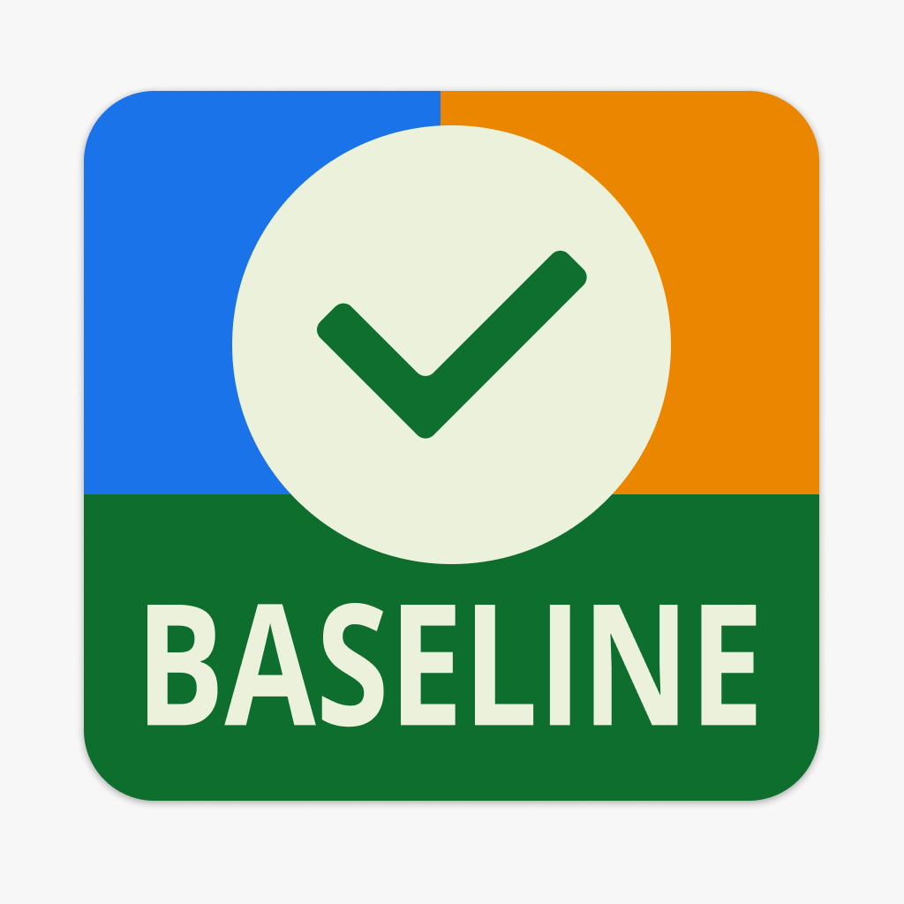
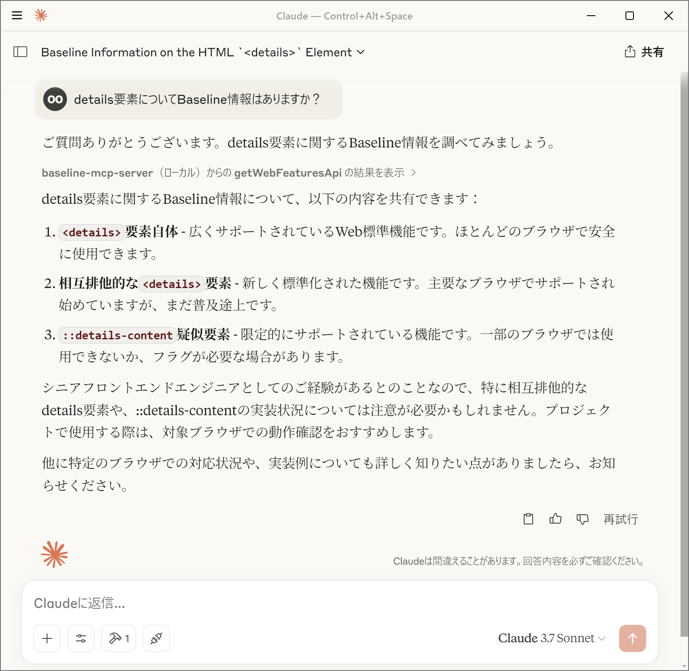

<p align="center">
	
</p>

<h1 align="center">Baseline MCP Server</h1>

Web Platform APIのサポート状況を提供するModel Context Protocolサーバーです。

[](https://jsr.io/@yamanoku/baseline-mcp-server)

## 概要

このサーバーは、[Web Platform Dashboard](https://webstatus.dev/)のAPIを使用して、WebのAPI機能のBaselineステータス（サポート状況）を取得できるMCPサーバーを実装しています。クエリに基づいてWeb機能の情報を取得し、その結果をMCPクライアントに返します。



## 機能

- Web Platform DashboardのAPIを使用した機能検索
- 機能のBaselineステータス（`widely`、`newly`、`limited`、`no_data`）の提供
- MCPを介した各種AIモデルとの連携

## Baselineステータスについて

Baselineステータスは、Web機能のブラウザサポート状況を示します：

- **widely**:
  広くサポートされているWeb標準機能。ほとんどのブラウザで安全に使用できます。
- **newly**:
  新しく標準化されたWeb機能。主要なブラウザでサポートされ始めていますが、まだ普及途上です。
- **limited**:
  限定的にサポートされているWeb機能。一部のブラウザでは使用できないか、フラグが必要な場合があります。
- **no_data**:
  現時点ではBaselineに含まれていないWeb機能。ブラウザのサポート状況を個別に確認する必要があります。

Baselineについての詳細については「[Baseline (互換性) - MDN Web Docs 用語集](https://developer.mozilla.org/ja/docs/Glossary/Baseline/Compatibility)」を参照してください。

## MCPクライアントでの設定

- サーバーを起動するにあたり、Denoの使用を推奨します
  - パーミッションとして`api.webstatus.dev`のみのアクセスを許可してください
- [`@yamanoku/baseline-mcp-server`](https://jsr.io/@yamanoku/baseline-mcp-server)を指定するか、お手元のローカル環境にbaseline-mcp-server.tsを設置して読み取るように設定してください

### Claude Desktop

Claude
DesktopのMCPクライアントで使用するには、以下のように`cline_mcp_settings.json`に設定を追加します。

```json
{
  "mcpServers": {
    "baseline-mcp-server": {
      "command": "deno",
      "args": [
        "run",
        "--allow-net=api.webstatus.dev",
        "jsr:@yamanoku/baseline-mcp-server"
      ]
    }
  }
}
```

### Visual Studio Code

Visual Studio
CodeのMCPクライアントで使用するには、以下のように`settings.json`に設定を追加します。

```json
{
  "mcp": {
    "servers": {
      "baseline-mcp-server": {
        "command": "deno",
        "args": [
          "run",
          "--allow-net=api.webstatus.dev",
          "jsr:@yamanoku/baseline-mcp-server"
        ]
      }
    }
  }
}
```

## 謝辞

このOSSはGPT-4o Image Generationによってロゴを製作、Claude 3.7 Sonnetによって実装、ドキュメントのサンプルを提案いただきました。感謝申し上げます。

## ライセンス

[MIT License](./LICENSE)
