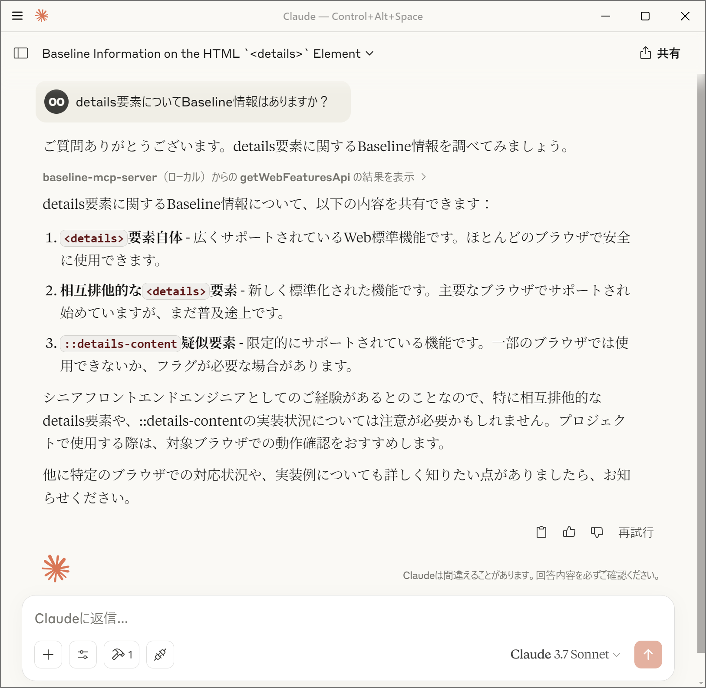

<p align="center">
	
</p>

<h1 align="center">Baseline MCP Server</h1>

[English Version](./README_EN.md) | [日本語版](./README.md)

A Model Context Protocol server that provides Web Platform API support status.

[](https://jsr.io/@yamanoku/baseline-mcp-server)

## Overview

This server implements an MCP server that can retrieve Baseline status (support
status) of Web API features using the
[Web Platform Dashboard](https://webstatus.dev/) API. It fetches information
about web features based on queries and returns the results to MCP clients.



## Features

- Feature search using Web Platform Dashboard API
- Providing Baseline status (`widely`, `newly`, `limited`, `no_data`) for
  features
- Browser implementation status (version and release date)
- Feature usage data
- Feature search excluding specific browsers (`chrome`, `edge`, `firefox`,
  `safari`)
- Integration with various AI models via MCP

## About Baseline Status

Baseline status indicates browser support for web features:

- **widely**: Widely supported web standard features. Safe to use in most
  browsers.
- **newly**: Newly standardized web features. Beginning to be supported in major
  browsers but still in the process of adoption.
- **limited**: Web features with limited support. May not be available in some
  browsers or may require flags.
- **no_data**: Web features not currently included in Baseline. Browser support
  status needs to be checked individually.

For more details about Baseline, refer to
"[Baseline (Compatibility) - MDN Web Docs Glossary](https://developer.mozilla.org/en-US/docs/Glossary/Baseline/Compatibility)".

## MCP Client Configuration

- Deno is recommended for running the server
  - Please only allow access to `api.webstatus.dev` as a permission
- Specify
  [`@yamanoku/baseline-mcp-server`](https://jsr.io/@yamanoku/baseline-mcp-server)
  or set up your local environment to read baseline-mcp-server.ts

### Claude Desktop

To use with Claude Desktop's MCP client, add the following configuration to
`cline_mcp_settings.json`:

```json
{
  "mcpServers": {
    "baseline-mcp-server": {
      "command": "deno",
      "args": [
        "run",
        "--allow-net=api.webstatus.dev",
        "jsr:@yamanoku/baseline-mcp-server"
      ]
    }
  }
}
```

### Visual Studio Code

To use with Visual Studio Code's MCP client, add the following configuration to
`settings.json`:

```json
{
  "mcp": {
    "servers": {
      "baseline-mcp-server": {
        "command": "deno",
        "args": [
          "run",
          "--allow-net=api.webstatus.dev",
          "jsr:@yamanoku/baseline-mcp-server"
        ]
      }
    }
  }
}
```

## Running with Docker

First, build the Docker image:

```shell
docker build -t baseline-mcp-server .
```

Configure your MCP client to run the Docker container:

```json
{
  "mcpServers": {
    "baseline-mcp-server": {
      "command": "docker",
      "args": [
        "run",
        "-i",
        "baseline-mcp-server:latest"
      ]
    }
  }
}
```

## Acknowledgements

The logo for this OSS was created by GPT-4o Image Generation, and the
implementation and documentation samples were suggested by Claude 3.7 Sonnet. We
express our gratitude.

## License

[MIT License](./LICENSE)
